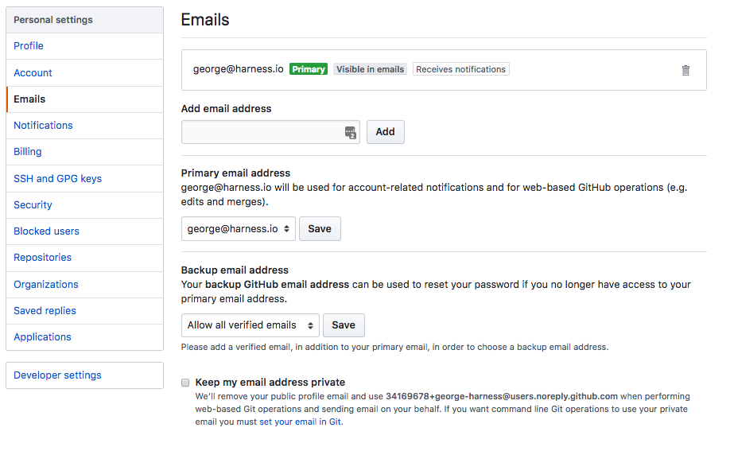
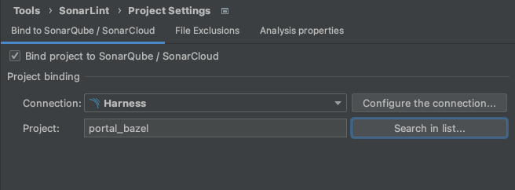
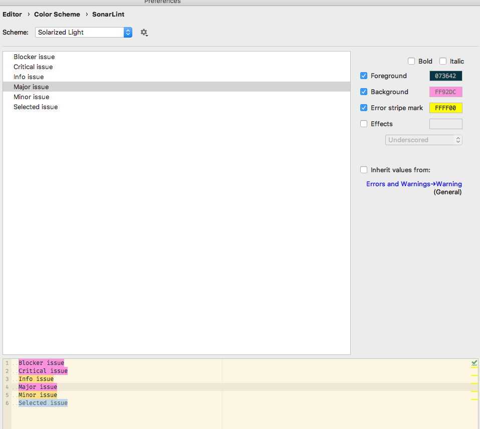
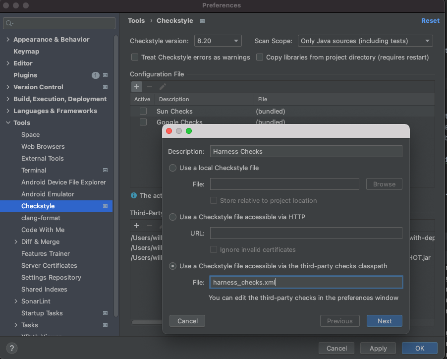
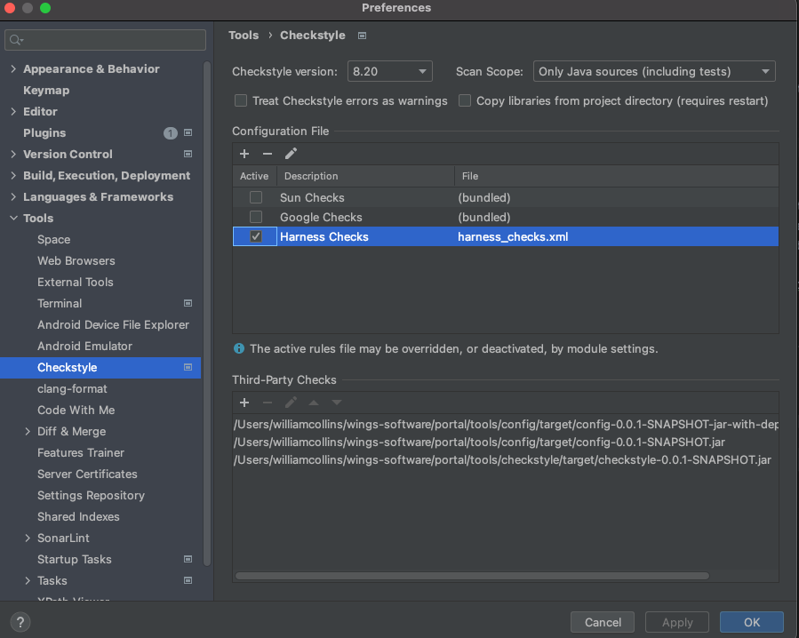

Portal Project Dev environment setup instructions
==================================================
cie
## On MacOS 

### Prerequisities
1. Install Homebrew:
```
/usr/bin/ruby -e "$(curl -fsSL https://raw.githubusercontent.com/Homebrew/install/master/install)"
```

2. Download and Install Java 8

NOTE: Brew will download and install latest version of OpenJDK/JRE, its recommended to install OpenJDK/JRE_1.8.0_242 to be in sync with version everyone is using in the team.

Download OpenJDK 1.8-242 (jdk8u242-b08) JRE Installer from [Java archive downloads](https://adoptopenjdk.net/archive.html), unzip it, then set `JAVA_HOME` and `PATH` accordingly.

3. Install maven and bazel:
```
brew install maven
brew install bazelisk

```

4. Install npm (used for front-end)
```
brew install npm
```

5. Set up JAVA_HOME: create or add this to your bash profile `~/.bashrc` or `~/.zshrc` file and add following line:
```
ulimit -u 8192
export JAVA_HOME=$(/usr/libexec/java_home -v1.8)
```

Do not add the first line on MacOS Catalina

6. Update /etc/hosts to reflect your hostname
```
255.255.255.255	broadcasthost
127.0.0.1  <your hostname>
::1        <your hostname>
```

7. Download and install `buf`
Complete this step only if you actively working with the protocol buffer files.
```
brew tap bufbuild/buf
brew install buf
```

To check if your protobuf files are according to the coding standards execute in the root of the repo
```
buf check lint
```

8. Bazel install
Create a file `.bazelrc` in your portal repo root with the following content
```
import bazelrc.local
build --define=ABSOLUTE_JAVABASE=<Java home path>
```
Here is a sample `.bazelrc`
```
import bazelrc.local
build --define=ABSOLUTE_JAVABASE=/Library/Java/JavaVirtualMachines/jdk1.8.0_202.jdk/Contents/Home
```

If you have regular bazel installed, please uninstall bazel and install bazelisk. It allows us to use the git repo to synchronize everyone's installation of bazel.

9. Download the data-collection-dsl username and password from [vault](https://vault-internal.harness.io:8200/ui/vault/secrets/secret/show/credentials/artifactory-internal-read) and add following lines in your `~/.bashrc` file
```
export JFROG_USERNAME=<username-here>
export JFROG_PASSWORD=<password-here>
```
### Github setup

1. Create harness dedicated github account. Use your harness email.

2. Make your email public as it is shown on the picture:

NOTE: This account will be used mostly in harness private repos, you should not be concerned for being over espoused.



3. Setup your public profile. The important fields are Name, Public email and Profile picture.
Please enter your First and Last name for the Name and select your harness email as Public email.
Please upload an easy to recognize image preferably of your face - with the team growing the autogenerated frogs from github are hard to use for identification.

NOTE: the data from it is used for every git operation github does on you behave as squashing changes or direct edits. This is why this is important.


### Git setup

1. Setup your harness email to the git config. You can do it globally or just for the portal repo:

    `git config --global user.email "email@harness.io"`

    or just for portal with

    `git config user.email "email@harness.io"`

2. Setup your name to the git config. We are using First and Last name. Please make sure you use the same spelling as you did for your github account.

    `git config --global user.name "FirstName LastName"`

    or just for portal with

    `git config user.name "FirstName LastName"`

3. Install git hooks. Portal comes with a set of convenient productivity booster set of hooks. For security reasons they cannot be enabled automatically.
   To do so execute the following command from the root of already cloned locally repo:

    `toolset/git-hooks/install.sh`

    NOTE: if you clone the repo to another location you will have to do this again. On the other side you will be getting fixes and updates with no extra effort.

### Build

1. Clone form git repository: https://github.com/wings-software/portal

   (Optional) Follow https://help.github.com/articles/adding-a-new-ssh-key-to-your-github-account/
   to setup your SSH keys. You can then use SSH to interact with git

2. Update your maven settings file
    a. Download the credentials for the Datacollection artifact from here : https://vault-internal.harness.io:8200/ui/vault/secrets/secret/show/credentials/artifactory-internal-read
    b. Copy the settings.xml file present under tools/build/custom-settings.xml and paste this file into ~/.m2/settings.xml (Remember to rename the file to settings.xml)
    c. Edit the file and replace the text "${REPLACE_USERNAME_HERE}" with the username from vault secret
    d. Replace "${REPLACE_PASSWORD_HERE}" with the encrypted password that was present in the vault secret


3. Go to `portal` directory and run

    `mvn clean install -DskipTests`

    `bazel build :all`

4. If Global Search is not required:

    Install and start MongoDB Docker Image (v3.6):
    ```
    $ docker run -p 27017:27017 -v ~/_mongodb_data:/data/db --name mongoContainer -d --rm mongo:3.6
    ```
    Verify the container is running using `docker ps`

    Install & use [RoboMongo](https://robomongo.org/download) client to test MongoDB connection.

5. If Global search has to be enabled (OPTIONAL):

    Install and start Elasticsearch Docker Image for Search(v7.3):
    ```
    $ docker run -p 9200:9200 -p 9300:9300 -v ~/_elasticsearch_data:/usr/share/elasticsearch/data -e "discovery.type=single-node" docker.elastic.co/elasticsearch/elasticsearch:7.3.0
    ```

    In portal/360-cg-manager/config.yml set `searchEnabled` to `true`.

    Run mongo in replica set:

    ```
    $ docker-compose -f <Directory to portal>/portal/docker-files/mongo-replicaset/docker-compose.yml up -d
    ```

    Add this to /etc/hosts:
    ```
    127.0.0.1       mongo1
    127.0.0.1       mongo2
    127.0.0.1       mongo3
    ```

    Run `brew tap mongodb/brew`
    Run `brew install mongodb-community@4.2`

    Run `mongo --port 30001`

    Run these in the mongo console:
    ```
    rs.initiate()
    rs.add('mongo2:30002')
    rs.add('mongo3:30003')
    ```

    In config.yml set `mongo.uri` to `mongodb://mongo1:30001,mongo2:30002,mongo3:30003/harness`.
    Do the same in `config-datagen.yml` and `verification-config.yml`.

6. If TimeScaleDB has to be enabled (Optional for now)

   a. Start TimeScaleDB using the following docker command: `docker run -d --name harness-timescaledb -v ~/timescaledb/data:/var/lib/postgresql/data -p 5432:5432 --rm -e POSTGRES_USER=admin -e POSTGRES_DB=harness -e POSTGRES_PASSWORD=password timescale/timescaledb`

   b. Set the TimeScaleDB config in the config.yml
  ```
  timescaledb:
    timescaledbUrl: jdbc:postgresql://localhost:5432/harness
    timescaledbUsername: admin
    timescaledbPassword: password
  ```
7. Install Redis - Follow the instructions from [here](https://gist.github.com/tomysmile/1b8a321e7c58499ef9f9441b2faa0aa8)


### Run Harness without IDE (especially for the UI development)
cd to `portal` directory
1. Start server by running following commands :

   * `bazel build //360-cg-manager:module_deploy.jar`
   * `java -Xms1024m -Xmx4096m -XX:+HeapDumpOnOutOfMemoryError -XX:+PrintGCDetails -XX:+PrintGCDateStamps -Xloggc:mygclogfilename.gc -XX:+UseParallelGC -XX:MaxGCPauseMillis=500 -Xbootclasspath/p:~/.m2/repository/org/mortbay/jetty/alpn/alpn-boot/8.1.13.v20181017/alpn-boot-8.1.13.v20181017.jar -Dfile.encoding=UTF-8 -jar .bazel-dirs/bin/360-cg-manager/module_deploy.jar server 360-cg-manager/config.yml > portal.log &`

2. Generate sample data required to run the services locally by running the following step only once.
   DataGenUtil: Open a new terminal and run following command (Make sure you [setup `HARNESS_GENERATION_PASSPHRASE` environment variable](https://docs.google.com/document/d/1CddJtyZ7CvLzHnBIe408tQN-zCeQ7NXTfIdEGilm4bs/edit) in your Bash profile):

   * `java -Xmx1024m -jar ~/.bazel-dirs/bin/160-model-gen-tool/module_deploy.jar server  160-model-gen-tool/config-datagen.yml`

3. Start Delegate

   * `java -Xmx4096m -XX:+HeapDumpOnOutOfMemoryError -XX:+PrintGCDetails -XX:+PrintGCDateStamps -Xloggc:mygclogfilename.gc -XX:+UseParallelGC -XX:MaxGCPauseMillis=500 -jar 260-delegate/target/delegate-capsule.jar 81-delegate/config-delegate.yml &`

4. Start Verification service (Optional)

   * `java -Xms1024m -Xmx4096m -XX:+HeapDumpOnOutOfMemoryError -XX:+PrintGCDetails -XX:+PrintGCDateStamps -Xloggc:mygclogfilename.gc -XX:+UseParallelGC -XX:MaxGCPauseMillis=500 -Xbootclasspath/p:~/.m2/repository/org/mortbay/jetty/alpn/alpn-boot/8.1.13.v20181017/alpn-boot-8.1.13.v20181017.jar -Dfile.encoding=UTF-8 -jar 270-verification/target/verification-capsule.jar server 79-verification/verification-config.yml > verification.log &`

5. Start Command Library Service (Optional)

   * `java -Xms1024m -Xmx4096m -XX:+HeapDumpOnOutOfMemoryError -XX:+PrintGCDetails -XX:+PrintGCDateStamps -Xloggc:mygclogfilename.gc -XX:+UseParallelGC -XX:MaxGCPauseMillis=500 -Xbootclasspath/p:<Your Home Directory>/.m2/repository/org/mortbay/jetty/alpn/alpn-boot/8.1.13.v20181017/alpn-boot-8.1.13.v20181017.jar -Dfile.encoding=UTF-8 -jar 210-command-library-server/target/command-library-app-capsule.jar 210-command-library-server/command-library-server-config.yml > command_library_service.log &`

### Editing setup

1. Install [clang-format](https://clang.llvm.org/docs/ClangFormat.html) (11.0.0)
Download the clang 11.0.0 tar from [this page](https://releases.llvm.org/download.html)
Untar the downloaded file and add it to your PATH in `~/.bashrc` or `~/.zshrc`

```
echo "export PATH="$PATH:$HOME/<path-to-above-directory>/bin" >> ~/.zshrc
```

helper shell scripts:

* `git clang-format` - makes sure all staged in git files are reformatted

* `find . -iname *.java | xargs clang-format -i` - formats all java files from the current directory down

### IntelliJ Setup

1. Install IntelliJ community edition 2020.1.4
2. Import `portal` as maven project
3. Install ClangFormatIJ Plugin: https://plugins.jetbrains.com/plugin/8396-clangformatij
   (use `Ctrl/Cmd-Alt-K` to format current statement or the selection)

   **WARNING:** For unclear reason in some environments the plugin causes IntelliJ to hang. If you are unlucky
   to be one of those cases there is alternative. Please use the external 3rd-party tool integration as
   described here: https://www.jetbrains.com/help/idea/configuring-third-party-tools.html.
   Configure the tool to look like shown on the image:

   .

   Then follow these instructions https://www.jetbrains.com/help/idea/configuring-keyboard-shortcuts.html to
   assign whatever key combination you would like it to be triggered on.

4. Install Lombok Plugin: https://projectlombok.org/setup/intellij
5. Install SonarLint plugin:
   - This plugin is really helpful to analyze your code for issues as you code.
   - Go to `Preferences -> Plugins` ->  type SonarLint -> Install plugin. (Will need to restart Intellij)
   - Go to `Preferences -> Other settings -> Sonarlint general settings`. Check "Automatically trigger analysis". Add a connection to `https://sonar.harness.io`. You'll need to create a custom token.
   - Go to `Preferences -> Other settings -> Sonarlint project settings`. Check "Bind project to sonarqube", and select the connection, and set project as `portal`. This is so that we use the same rules locally instead of the default rules.
    .
   - Go to `Preferences -> Editor -> Colorscheme -> Sonarlint`. For Blocker, Critical & Major, untick "Inherit values from" checkbox and configure a different highlighting style. These violations are treated as release blockers and this configuration is to highlight them differently from regular warnings.
    .
   - Just right click on file in intellij and "Analyze with SonarLint" or enable autoscan.
6. Install the [IntelliJ Checkstyle Plugin](https://plugins.jetbrains.com/plugin/1065-checkstyle-idea). Setup Checkstyle plugin. In `Preferences -> Other settings -> Checkstyle` add `tools/config/target/config-0.0.1-SNAPSHOT-jar-with-dependencies.jar` and `tools/checkstyle/target/checkstyle-0.0.1-SNAPSHOT.jar` jars in the repo to the 3rd party checks classpath. Add configuration file `harness-checks.xml` (Choose the option to resolve the file from the 3rd party checks classpath - it's within the config jar) and choose it as the default active. Set scan scope to  `java sources including tests`.
   *  .
   *  .
7. Change settings to mark injected fields as assigned. (Settings > Editor > Inspections > Java > Declaration Redundancy > Unused Declarations>Entry Points >
   Annotations > Mark field as implicitly written if annotated by) Click add, then search for "Inject". Add both google and javax annotations.
   *  .

8. Increase Build Process Heap Size (Preferences > Build, Execution, Development > Compiler, search for "Build Process Heap Size" and set it to 2048 or higher if you still see an out of memory exception in future)

9. Install bazel project plugin from the IntelliJ marketplace

10. If facing build issues make sure you have enabled "Always update snapshots" in IntelliJ (Preferences > Build, Execution, Deployment > Build Tools > Maven) 


### Run from IntelliJ

Run configurations for the different applications are already checked into the repo. Choose the appropriate run configuration from the menu.
While running an app from pre checked in configs, Add JAVA_HOME as an environment variable in Intellij. 


### Show current git branch in command prompt

If you are using zsh (which is default on MacOS Catalina and later), basic git integration comes out of the box.

If you are using bash, add the following to your `~/.bash_profile` to display the current git branch in the command prompt:

```
parse_git_branch() {
  git branch 2 > / dev / null | sed - e '/^[^*]/d' - e 's/* \(.*\)/ (\1)/'
}
export PS1="\[\033[34m\]\w\[\033[36m\]\$(parse_git_branch)\[\033[31m\] $\[\033[0m\] "
```

Alternatively, use Fish shell: `brew install fish` then set iterms command to `/usr/local/bin/fish`

### Before you can use the client:

1. Make sure your mongodb is running first.

2. Run API Server (WingsApplication): [Run > Run... > WingsApplication]

3. Run DataGenApp: [Run > Run... > DataGenApp]. Add HARNESS_GENERATION_PASSPHRASE environment variable to DataGenApp config in intellij. 

4. Run DelegateApplication: [Run > Run... > DelegateApplication]

The admin username and password are in BaseIntegrationTest.java.

### Note:

1. To build UI Go to wingsui and follow READ me instructions.

2. To apply database migrations run following command in dbmigrations folder:

   `mvn clean compile exec:java`

### Common problems:
* If you get an error about missing build.properties when you start the server, do a mvn clean install.
* If you get a SupportedEllipticCurvesExtension NoClassDefFoundError, Its likely that jsse.jar in /Library/Java/JavaVirtualMachines/<JDK Version>/Contents/Home/jre/lib folder does not have this class definition. Copy this file from a Team member.
    * If you have `jsse.jar` but still getting that error, then make sure the default JDK for your maven module is set correctly in IntelliJ. Right Click Module in left sidebar > Open Module Settings > Platform Settings > SDKs)
* If you go to https://localhost:8000/#/login and don't see content, go to https://localhost:8181/#/login to enable the certificate then try again.
* If still face not able to login then got to https://localhost:9090/api/version and enable certificate and try again.

### Python

* Refer to the readme under python/splunk_intelligence

### Troubleshooting

https://github.com/wings-software/portal/wiki/Troubleshooting-running-java-process


# Go Development
## Prerequisites
### Install Go
1. Install Go 1.14 [here](https://golang.org/dl/)
2. Add this to .bash_profile: `export PATH=$PATH:~/go/bin`
3. Install dependent tools by running:
```lang=bash
portal/tools/go/go_setup.sh
```
### Install Bazelisk
4. On mac: `brew install bazelisk`
   * Other platforms: Follow the instrictions [here](https://github.com/bazelbuild/bazelisk)


### IDE
Jetbrains has GoLand editor but its not free. If we continue using intelliJ for Go, then we need a plugin called Go, but it’s not supported on Community Edition(free) of intelliJ.
* So recommendation is to use VsCode(free) which is better than intelliJ for Go development.
* Once you install VsCode, open and install the plugin  `Microsoft Go`
* Note: If your autocomplete is not working, disable `gopls`

Alternately, gopls has a langserver implementation which hooks up cleanly to IntelliJ as LSP client.

## Documentation
This page contains the most common commands and recommendations, for more details go to [bazel homepage](https://docs.bazel.build/versions/master/getting-started.html).
Bazel has extensive documentation available online.

You can start with the [user guide](https://docs.bazel.build/versions/master/user-manual.html) and [best practices](https://docs.bazel.build/versions/master/best-practices.html)

Documentation about the Go ruleset is available on github as part of [bazelbuild/rules_go](https://github.com/bazelbuild/rules_go), most importantly go through the set of core rules for Go [here](https://github.com/bazelbuild/rules_go/blob/master/go/core.rst).


### Building

You should use the `bazel build` command to build a project:
```lang=bash
bazel build //path/to/project/...
```
For more information about build target pattern syntax run:
```lang=bash
bazel help target-syntax
```

Examples:
#### Building all packages under commons/go:
```lang=bash
bazel build //commons/go/...
```
Note that `//` stands for the repo root, if you run command from the repo root then you may omit it and instead run:
```lang=bash
bazel build commons/go/...
```

#### Building the entire portal repo:
```lang=bash
bazel build //...
```

#### Building all targets in the current folder:
```lang=bash
bazel build
```

#### Building all code in the current folder and all sub-folders:
```lang=bash
bazel build ...
```

#### Building all code in the directory foo:
```lang=bash
bazel build foo:all
```
For additional information, run:
```lang=bash
bazel help target-syntax
```

#### Cross-Compiling
You can cross-compile any go_binary target on demand to a specific platform by running:
```lang=bash
bazel build --platforms=@io_bazel_rules_go//go/toolchain:linux_amd64 //cmd
```

For details see the [Go rules for Bazel](https://github.com/bazelbuild/rules_go#how-do-i-cross-compile).


## Testing

Tests can be executed using the `bazel test` command:
```lang=bash
bazel test //path/to/project/... # will run all tests under //path/to/project
bazel test //path/to/project:target # will run the test named "target" under //path/to/project
```
Note that test targets tagged as `manual` are skipped in `...` if not specified explicitly.

Examples:
#### Running all tests under lib:
```lang=bash
bazel test //commons/go/lib/...:all --test_summary=detailed  # will run all tests under lib
```

#### Running tests in entire repo:
```lang=bash
bazel test //...
```

#### Running tests in the current folder:
```lang=bash
bazel test
```

#### Running a specific test:
```lang=bash
bazel test //commons/go/lib/logs:go_default_test
```

#### Running test in the current folder and all sub-folder:
```lang=bash
bazel test ...
```

#### Running tests in the sub-folder foo:
```lang=bash
bazel test foo:
```

#### Benchmark: Running benchmark tests:
```lang=bash
bazel run //commons/go/lib/<module>:"internal_tests" -- -test.bench=<keyword identifying the resolver> -test.benchmem
bazel run //commons/go/lib/logs:go_default_test -- -test.bench=harness -test.benchmem # an example
```

#### Browsing code coverage
```lang=bash
bazel coverage <target pattern>
bazel coverage //commons/go/lib/logs:go_default_test # an example
```

## Running

Bazel allows running executable targets using:
```
bazel run //path/to/target:target
bazel run //commons/go/lib/logs:go_default_test # an example
```


## Managing Build Configuration

#### Generating BUILD.bazel files

BUILD.bazel files contain build rules. If you've added/removed packages or modified dependencies in the source code, or added new rules manually,
then you should run `gazelle` to update and format your BUILD.bazel files.
This tool will add any missing rules, update dependencies and format all BUILD.bazel files that you've touched.
Run:
```lang=bash
gazelle
```
The above comand creates or updates `BUILD.bazel`


We need to update the dependencies in `portal/WORKSPACE`. Run the following for your new/updated `go.mod`
```lang=bash
update_bazel_repo.sh commons/go/lib/go.mod # an example
```
This updates the `portal/WORKSPACE` file with new dependencies. Check-in `portal/WORKSPACE` file and any updated `go.mod` and `go.sum` files.


# How to use local module in an application outside the module
* We are using bazel for building and testing go source code. bazel needs BUILD.bazel files and doesn't need go.mod or go.sum files
go.mod and go.sum files  are needed for native go tools
* bazel uses $PROJECT_ROOT/WORKSPACE to store go repositories which has information found in both go.mod and go.sum bazel uses $PROJECT_ROOT/WORKSPACE for dependency management and BUILD.bazel for actual execution of targets

* To use local modules in an application
* for eg., to use module `lib` in an application `ci-addon`, we need to perform these actions:
```lang=bash
cd ci/addon #cd to the application folder where main.go is located
```
```lang=bash
go mod init <module-name>   # this generates go.mod and go.sum
```

* update go.mod by adding the following line to point to local repository (replace module and relative path to match yours):
```lang=bash
replace github.com/wings-software/portal/commons/go/lib => ../../../commons/go/lib
```
* (the above replace is needed only if you are outside the module you want to import)
```lang=bash
go get  # this updates go.mod
```
```lang=bash
gazelle  # generates, updates BUILD.bazel
```
* To update go_repository() at portal/WORKSPACE, run this script as:
```lang=bash
portal/tools/go/update_bazel_repo.sh go.mod
```
# How to enable aws sdk logging in Manager/Delegate app locally
NOTE: Below changes are only recommended in local environment and changes shall not be pushed.

AWS SDK library internal logging is done using SLF4J. SLF4J serves as a simple facade or abstraction for various logging frameworks (e.g. java.util.logging, logback, log4j)

We are already using logback framework in our application, so it is simple to enable logging as it is already supported in SLF4J.
* Delegate - To enable AWS SDK logging in delegate, update root logger level to TRACE in logback.xml file in 260-delegate module resources folder and restart delegate.
* Manager - To enable AWS SDK logging in manager, update root logger level to TRACE in logback.xml file in 360-cg-manager module resources folder and restart manager.
